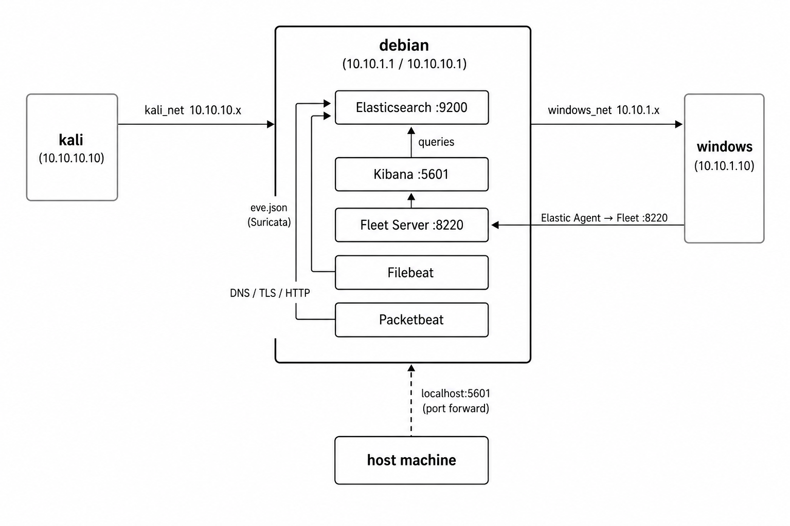

# Reproductible lab to study XDR/Network IPS evasion with Elastic Security and Suricata.

## Warning

This lab is not a prod environment and should not be used as such. Most of the security between the Elastic services are disabled.

## Architecture

3 VMs are created named :
- kali : to simulate an attacker.
- debian : an NGFW that intercepts all traffic between kali and windows.
- windows : to simulate a target.

Note that kali machine is a debian machine with a few pentesting tools installed.



The debian VM is the core of the lab. It runs :
- **Suricata** — network IDS in NFQUEUE mode. Every packet transiting between kali and windows goes through it. Alerts are written to `/var/log/suricata/eve.json`.
- **Elasticsearch** — stores all events (Suricata alerts, Packetbeat flows, Elastic Agent telemetry).
- **Kibana** — web UI to visualize events and manage detection rules. Exposed on the host at `localhost:5601` via port forward.
- **Fleet Server** — manages Elastic Agents remotely (enrollment, policy updates). Windows connects to it on port `8220`.
- **Filebeat** — ships Suricata alerts (`eve.json`) to Elasticsearch.
- **Packetbeat** — captures and parses network protocols (DNS, HTTP, TLS, ICMP) directly on the debian interfaces.

## Pre-requisites

- VirtualBox version 7.2.8 or higher
- Vagrant version 2.4.9 or higher

## Installation

On Ubuntu 24.04.4 LTS

1. Install Vagrant

```bash
wget -O - https://apt.releases.hashicorp.com/gpg | sudo gpg --dearmor -o /usr/share/keyrings/hashicorp-archive-keyring.gpg
echo "deb [arch=$(dpkg --print-architecture) signed-by=/usr/share/keyrings/hashicorp-archive-keyring.gpg] \
  https://apt.releases.hashicorp.com \
  $(grep -oP '(?<=VERSION_CODENAME=).*' /etc/os-release || lsb_release -cs) main" \
  | sudo tee /etc/apt/sources.list.d/hashicorp.list

sudo apt update && sudo apt install vagrant
```

2. Install VirtualBox

```bash
sudo apt install virtualbox
```

3. Run the lab

```bash
git clone https://github.com/LuigiSpark/lab-edr
cd lab-edr
vagrant up
```

## How to use it ?

Kibana is accessible directly on the host at: http://localhost:5601

To connect to a VM in ssh on kali (or windows / debian):

```bash
vagrant ssh kali
```

If you install new tools, you can create snapshots.

```bash
vagrant snapshot save "Name"
```

To list and restore it:

```bash
vagrant snapshot list
vagrant snapshot restore <name of the vm> (optional)
```

## Extra-tools. 

### Cross-compilation : Windows binary on linux. 

The x86_64 version of mingw32 gcc is preinstalled. 


